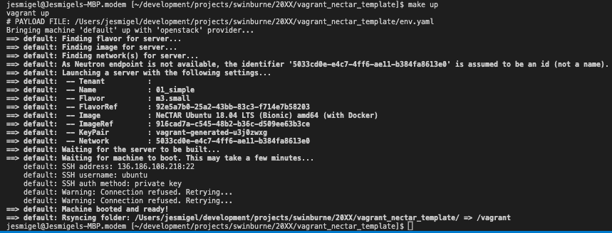
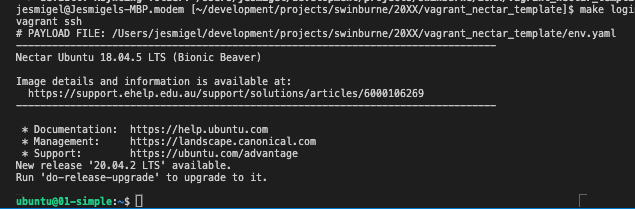

# vagrant_nectar_template
Code template to deploy a VM in Nectar (OpenStack) for rapid prototyping purposes

### References
| Label | Comment |
| - | - |
| [Vagrant](https://www.vagrantup.com/downloads) | Virtual Machine manager |
| [vagrant-openstack-provider](https://github.com/ggiamarchi/vagrant-openstack-provider) | Opensource plugin that performs API calls to OpenStack |
| [Nectar]() | Research Cloud. Openstack |
|||

### Pre deployment requirements
1. Create a security group on Nectar. Ensure that Inbound SSH traffic is enabled
2. Copy sample.env.yaml to env.yaml, update values as necessary.
3. Ensure that Vagrant is installed

### Make commands
| Command | Comment |
| - | - |
| `make up` | Resumes the VM. Creates if it doesnt exist |
| `make down` | Suspends the VM |
| `make clean` | Destroys the VM and Corresponding ssh key |
| `make status` | Checks the VM status |
| `make login` | Login to the VM by means of SSH |
|||

### Deployment
Create the VM using `make up`

Login to the VM using `make login`

